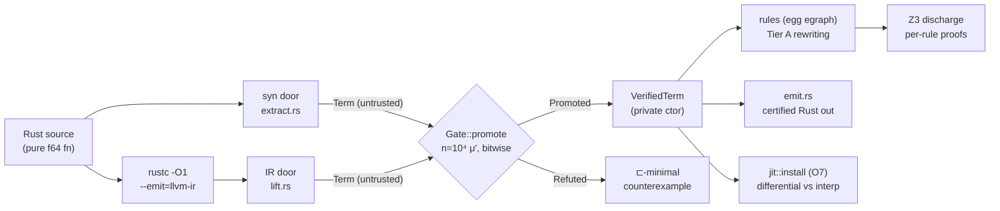
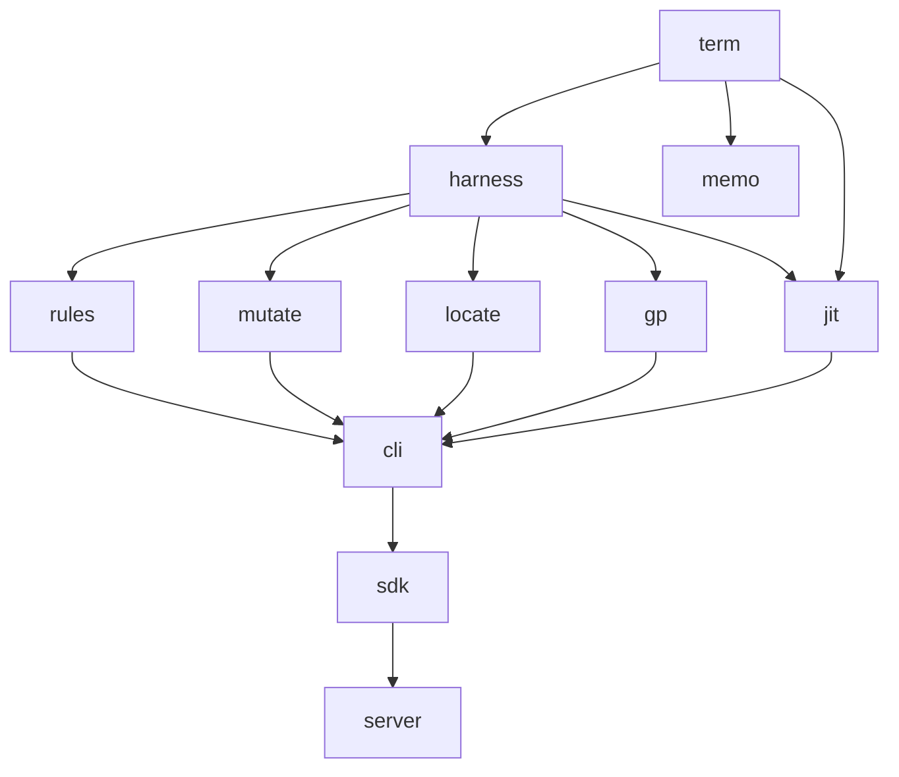

# deductive-gp-engine (`dge`) — Engineering Documentation

**A refactoring, testing, debugging, and JIT engine for pure `f64`
numeric code, where nothing ships without a certificate.** Rust
functions are extracted into a small verified term language (Σ, "Term_p"),
rewritten / mutation-tested / fault-localized / evolved / JIT-compiled —
and every stage exits through exactly one typed door: a **Tier A**
certificate (per-rule SMT proof), a **Tier B** certificate (statistical
equivalence quantified as *n*, *α*, *δ_min* over a recorded input
distribution), or an **explicit refusal** carrying the exact reason and,
where applicable, a counterexample. "Probably fine" is not a value in
this system.

This document is the complete engineering reference: everything needed
to build, navigate, test, extend, and review this codebase before
committing. External integration contracts live separately
([docs/SDK.md](docs/SDK.md), [docs/API.md](docs/API.md)); the project's
append-only history lives in [docs/HISTORY.md](docs/HISTORY.md).

---

## Table of contents

1. [Navigation & search](#1-navigation--search)
2. [Quick start](#2-quick-start)
3. [System overview](#3-system-overview)
4. [Architecture](#4-architecture)
   - [4.1 Crate map](#41-crate-map)
   - [4.2 The typestate spine](#42-the-typestate-spine)
   - [4.3 Forbidden inversions](#43-forbidden-inversions)
5. [The Σ term language (v1.7)](#5-the-σ-term-language-v17)
   - [5.1 Operator table](#51-operator-table)
   - [5.2 S-expression grammar](#52-s-expression-grammar)
   - [5.3 Extension ops (Σ-ext)](#53-extension-ops-σ-ext-v17)
   - [5.4 Semantic guarantees](#54-semantic-guarantees)
6. [The two front doors](#6-the-two-front-doors)
   - [6.1 syn door](#61-syn-door)
   - [6.2 IR door](#62-ir-door)
7. [The Gate](#7-the-gate)
8. [JIT (O7)](#8-jit-o7)
9. [Emission](#9-emission)
10. [CLI reference](#10-cli-reference)
11. [Extension surface (SDK & HTTP)](#11-extension-surface-sdk--http)
12. [Testing](#12-testing)
13. [Contribution rules](#13-contribution-rules)
14. [Field data snapshot](#14-field-data-snapshot)
15. [Roadmap](#15-roadmap)
16. [Documentation map](#16-documentation-map)

---

## 1. Navigation & search

Markdown has no runtime search box; this project gives you something
stronger — a **grep contract**:

> Every refusal message in code echoes the vocabulary used in the docs,
> and vice versa. `grep` on either side finds the other.

Recipes:

```bash
# You saw a refusal at runtime — find its code path:
grep -rn "coupled recurrences" crates/

# You read about a feature in HISTORY — find its tests:
grep -rln "fission" crates/*/tests/

# Where is an op handled end to end? (add-an-op checklist, §13.3)
grep -rn "Rnd32" crates/ --include="*.rs" -l

# Which histogram bucket does a refusal land in?
grep -n "fn bucket" crates/cli/src/trial.rs
```

On GitHub, `t` (file finder) and `/` (code search) work over this
repository; every heading above is an anchor link for deep-linking into
this file.

---

## 2. Quick start

**One command, zero prior knowledge**: `./try.sh` — checks
prerequisites, builds, and runs two bundled examples (one certifies,
one is honestly refused) with a plain-English summary of each. Run
`./try.sh myfile.rs my_function` for your own code. This is the same
pipeline described below, run in the right order for you; nothing about
it is a shortcut or a weaker guarantee.

The manual path, for engineers who want to see each step:

Prerequisites: stable Rust (tested on 1.97), and for the full pipeline
two external tools — `rustc` on PATH (the IR door shells out to it) and
`z3` (Tier A rule discharge; `apt install z3` is sufficient).

```bash
git clone <repo> && cd deductive-gp-engine
cargo build --workspace              # zero-config build
cargo test  --workspace              # 132 tests, all green expected
cargo build --release -p cli         # the `dge` binary
cargo build --release -p server      # the `dge-serve` binary
```

30-second smoke test:

```bash
$ cat > /tmp/poly.rs <<'EOF'
#[no_mangle]
pub fn poly(x: f64) -> f64 {
    3.0 * x * x * x + 5.0 * x * x + 2.0 * x + 7.0
}
EOF
$ ./target/release/dge pipeline /tmp/poly.rs poly
# -> rewritten Rust with the certificate as a doc comment, or a refusal
#    with the concrete input that would have broken the rewrite
```

If a command refuses, that is a *result*, not a failure — read the
message; it names the exact unsupported construct and whether it is
roadmap or out-of-perimeter.

Whole-codebase, in place, in one command:

```bash
$ ./target/release/dge optimize ./src
# every eligible f64 function under ./src is certified and rewritten in
# place with its certificate attached; the rest are left untouched with a
# printed reason. Auto-discharges the proof table on first run; keeps a
# .bak per file. Add --dry-run to preview, --all for the with-effort class.
```

`optimize` is a pure orchestration layer over `pipeline` plus one extra
gate: before any byte is written, the rewritten source is re-extracted
*in file context* and checked bitwise-equal to the proven term over μ′ —
so the in-place edit inherits the pipeline's guarantee exactly. Nothing
uncertified is ever written.

---

## 3. System overview



Two independent *front doors* translate source into candidate terms.
Extraction is **untrusted by architecture**: both doors' outputs are
gated bitwise against each other and/or the compiled original before
anything downstream sees them. Downstream consumers (rewriting, codegen,
JIT) only accept `VerifiedTerm`, which has exactly one constructor —
inside the Gate.

---

## 4. Architecture

### 4.1 Crate map

Nine core crates plus two integration crates, in dependency-DAG order
(build order = topological order; see the workspace `Cargo.toml` header):

| Crate | Phase | LOC | Role | Key modules |
|---|---|---|---|---|
| `term` | R0 | ~900 | Σ AST, arity/signature, interpreter (reference semantics), s-expr parse/print, fold ownership validation | `sig.rs`, `ast.rs`, `interp.rs`, `sexpr.rs` |
| `harness` | R1 | ~700 | **The judge.** Gate (n, α, δ dials), μ′ strategy, counterexample shrinking, certificates | `gate.rs`, `strategy.rs` |
| `rules` | R2 | ~1100 | Tier A rewriting: egg egraph language, Dec rule table, cost model, Z3 SMT seam | `lang.rs`, `r_dec.rs`, `cost.rs`, `smt.rs` |
| `mutate` | R3 | ~300 | Mutation operators (op-swap, child-swap, const-perturb), equivalence filtering | `ops.rs`, `eqfilter.rs` |
| `locate` | R4 | ~100 | Ochiai fault localization over pinned suites | |
| `gp` | R5 | ~450 | Evolutionary repair/search over Σ terms | `evolve.rs`, `repair.rs` |
| `memo` | R6 | ~200 | Term-keyed memoization | |
| `jit` | R7 | ~530 | Cranelift lowering + **O7 differential install gate** | `lower.rs` |
| `cli` | R7 | ~4500 | Both front doors, pipeline, emission, field-trial harness, all subcommands | `extract.rs`, `lift.rs`, `trial.rs`, `emit.rs`, `pipeline.rs` |
| `sdk` | R8 | ~360 | Stable integration surface: `FrontDoor` / `Observer` traits, `Engine` facade, `register_ext_op` (Σ-ext, v1.7), `Suggester` trait + `Engine::optimize` (v1.8), `Emitter` trait + `optimize_with_cost` (v1.9) | `lib.rs` |
| `server` | R9 | ~240 | HTTP isolation boundary (`dge-serve`) over the SDK | `lib.rs`, `main.rs` |



### 4.2 The typestate spine

```
Term ──Gate::promote──▶ VerifiedTerm ──jit::install──▶ JitFn
         (the ONLY               (the ONLY
          constructor)            constructor)
```

The three types are states; the two arrows are the only transitions, and
each is a *gate*, not a cast:

| Transition | Where | What it checks |
|---|---|---|
| `Term → VerifiedTerm` | `harness::gate::Gate::promote` | Bitwise agreement with the reference over n = 10⁴ μ′ samples (NaN ≡ NaN), incl. sequence length L = 0 |
| `VerifiedTerm → JitFn` | `jit::install` (O7) | Differential: compiled code vs the reference interpreter over a fresh gate; any mismatch pins execution to the interpreter |

`VerifiedTerm { term: Term /* private on purpose */, cert }` — the
private field is load-bearing. **The type system is the audit trail**:
if code holds a `VerifiedTerm`, a gate ran; there is no other way to
obtain one. This is also why the SDK/HTTP layers never surface one
(§11).

### 4.3 Forbidden inversions

From the workspace manifest, enforced by the dependency graph:

* `term` depends on **nothing**.
* `harness` never depends on `rules`/`gp` — *the judge must not import
  the contestants*.
* The core never imports `sdk`/`server` — extension surfaces sit above,
  and the Gate stays sealed below them.

A PR that inverts any of these is wrong regardless of what it fixes.

---

## 5. The Σ term language (v1.7)

Σ ("Term_p") is deliberately tiny: total, pure, f64-valued, with one
bounded-iteration construct (`fold`). Everything the engine proves or
claims is stated over this language.

### 5.1 Operator table

33 ops. "Payload" ops carry an index instead of children.

| Op | Arity | Sexpr | Semantics | Notes |
|---|---|---|---|---|
| `Const` | 0 | `1.5` | pool constant | payload = const index |
| `Var` | 0 | `(var k)` | environment slot k | payload |
| `Neg` | 1 | `(neg a)` | `-a` | exact |
| `Abs` | 1 | `(abs a)` | `a.abs()` | exact |
| `Sqrt` | 1 | `(sqrt a)` | IEEE `sqrt` | correctly rounded |
| `Floor` / `Ceil` | 1 | `(floor a)` | IEEE | exact on representables |
| `Sin` `Cos` `Tan` `Exp` `Exp2` `Ln` | 1 | `(sin a)` … | libm | **Tier B only** (transcendental; no rewrite proofs) |
| `Rnd32` | 1 | `(rnd32 a)` | `(a as f32) as f64` | Σ v1.6 f32-semantics symbol; no rule rewrites through it |
| `Add` `Sub` `Mul` `Div` | 2 | `(+ a b)` … | IEEE f64 | |
| `Min` / `Max` | 2 | `(min a b)` | Rust `f64::min/max` | NaN-propagation per Rust |
| `Pow` | 2 | `(pow a b)` | `powf` | Tier B only |
| `Lt` `Gt` `Le` `Ge` | 2 | `(lt a b)` | 1.0/0.0-valued; **false on NaN** | IEEE ordered |
| `Eq` | 2 | `(eq a b)` | `fcmp oeq` ≡ Rust `==` | `-0.0 == +0.0` → 1.0; NaN → 0.0 |
| `Ne` | 2 | `(ne a b)` | `fcmp une` ≡ Rust `!=` | **true on NaN** (not sugar for `1-eq`) |
| `Fold` | 2 | `(fold init body)` | left fold over the runtime sequences' shared length L | L = 0 ⇒ init; body is Tier B (no rewriting under fold — unbounded data has no decidable theory) |
| `Acc` | 0 | `acc` | current accumulator | **valid only inside a fold body** (validated) |
| `Elem` | 0 | `(elem k)` | current element of sequence k | body-only (validated); payload |
| `Len` | 0 | `(len k)` | sequence k's length as f64 | valid anywhere (loop-invariant); exact for real slices |
| `Fma` | 3 | `(fma a b c)` | `a.mul_add(b, c)` | single rounding |
| `Select` | 3 | `(select c t e)` | `c != 0.0 ? t : e` | the only branch symbol; keeps terms total |

Multiple *sibling* folds in one term are legal (Σ v1.5 "fission"); each
`Acc`/`Elem` belongs to exactly one fold, validated by
`term::ast::fold_owners` — an ill-formed term is a construction-time
error, not a runtime surprise.

### 5.2 S-expression grammar

```
expr  := f64-literal            ; 1.0, -3.5e2, NaN not writable (by design)
       | (op expr…)             ; arity checked against §5.1
       | (var N) | (elem N) | (len N)
       | acc
```

Parse/print: `term::sexpr::{parse, print}`. Print∘parse is the identity
on valid terms; the emitted Rust (§9) round-trips through the syn door
(pinned by tests).

Examples:

```lisp
(+ (var 0) 1.0)                          ; x + 1
(fold 0.0 (+ acc (elem 0)))              ; Σ over sequence 0
(- (fold 0.0 (+ acc (* (elem 0) (elem 0))))
   (fold 0.0 (+ acc (elem 0))))          ; two sibling folds (fission)
(rnd32 (* (rnd32 (var 0)) (rnd32 (var 0))))  ; f32 square, f32 inputs
```

### 5.3 Extension ops (Σ-ext, v1.7)

Two more ops complete the alphabet, and they are unusual: **their
semantics are not in this codebase.**

| Op | Arity | Sexpr | Semantics |
|---|---|---|---|
| `Ext1` | 1 | `(ext:<name> a)` | resolved by NAME through `term::ext`'s runtime registry |
| `Ext2` | 2 | `(ext:<name> a b)` | ditto |

The insight behind this: **the Gate never needed to understand
semantics — it needs to catch lies.** Arbitration is black-box (sample,
run both sides, compare bits), so meaning can be pluggable while the
Gate itself stays sealed and unmodified. A plugin registers a name, an
arity, a version, and a **fingerprint** (its own semantic-identity
claim — a spec ID or source hash) against a closure; terms reference the
op by name and stay plain data (`Term.exts: Vec<String>` is the
name table; a term with ext ops parses/prints/hashes without the
registry present at all).

What changes for the rest of the system, and why each is correct rather
than merely convenient:

| Consumer | Behavior | Why |
|---|---|---|
| Interpreter | dispatches through `term::ext::lookup` | reference semantics IS the registry |
| **Gate** | **double-runs every sample on ext-bearing terms** | enforces determinism — doesn't assume it; a nondeterministic op refutes ITSELF (run 1 vs run 2 as the counterexample) |
| Rules (egraph) | `has_ext()` guarded at the one entry point; ext terms bypass rewriting entirely (Tier B identity-gated) | no rewrite has a proof of PLUGIN algebra |
| JIT | `w_ext1`/`w_ext2` Cranelift trampolines call the SAME registry closure the interpreter uses | one semantics, still O7-differentialed |
| Emission | prints a call to the plugin's own Rust symbol | the emitted file's correctness depends on linking against that symbol |
| Certificate | `ext_semantics: Vec<String>` of `name@version#fingerprint` tags | a claim under plugin semantics says so, in the artifact, forever — "equivalent MODULO these semantics," not "equivalent" |

Registration is **identity, not trust** — a plugin can claim anything
about its op's meaning; if that claim is wrong, gating it against a
reference term fails exactly like a lying `FrontDoor` does (§11):
bit-level disagreement, ⊏-minimal counterexample, no different from any
other refutation.

```lisp
(ext:relu (var 0))                          ; plugin op, one child
(* 0.5 (ext:gauss (+ (var 0) (var 1))))     ; composes with core Σ freely
(fold 0.0 (+ acc (ext:halfsq (elem 0))))    ; legal inside fold bodies too
```

### 5.4 Semantic guarantees

Engineers may rely on (and must preserve) the following:

1. **One semantics, three implementations.** The interpreter
   (`term::interp`) is the *reference*. The JIT and the emitter must be
   bit-identical to it — enforced by O7 differential install and the
   emission round-trip tests, not by review.
2. **Totality.** Every Σ term is total over all f64 envs and all
   sequence lengths ≥ 0. There is no partial construct; source-level
   partiality (panics/asserts) refuses at the doors (§6).
3. **NaN discipline.** Comparisons follow IEEE/Rust exactly (see table).
   Gate equality is `bits(a) == bits(b) || (a.is_nan() && b.is_nan())`.
4. **The Rnd32 theorem (Σ v1.6).** For `+ - * / sqrt` over
   f32-representable operands, f64-compute-then-`Rnd32` is
   **bit-identical** to native f32 (double rounding is innocuous:
   f64's p = 53 ≥ 2·24 + 2). This is why f32 functions get real bitwise
   gates. Transcendentals are *not* innocuous (`sinf ≠ round64(sin)`)
   and must keep refusing in f32 extraction.
5. **No rewriting under `fold`, none through `Rnd32`, none through
   `Ext1`/`Ext2`.** The rules crate represents all three but rewrites
   none of them (unbounded data / broken algebraic identities / opaque
   plugin semantics, respectively).
6. **Extension-op determinism is enforced, not trusted (v1.7).** The
   Gate double-runs every μ′ sample on any term touching `Ext1`/`Ext2`;
   a plugin op that isn't a pure function of its arguments refutes
   itself before it can corrupt a claim.

---

## 6. The two front doors

Both doors translate source into **untrusted** candidate `Term`s. They
are independent implementations on purpose: their bitwise agreement over
μ′ is itself evidence (the "cross-door gate" in trial reports).

### 6.1 syn door

Code: `crates/cli/src/extract.rs`.

Reads Rust **syntax** (via `syn`). Coverage highlights:

| Construct | Reading |
|---|---|
| f64 scalar / `[f64; N]` / `&[f64]` params | Var / Var-array / sequence (fold input) |
| `let`, shadowing, blocks, if/else as values | scope stack, `Select` |
| `for i in 0..n` (bounded) | unrolled |
| `for` over a slice with scalar accumulation | `Fold`; N mutated scalars ⇒ N sibling folds (v1.5 fission) |
| `&self` methods (struct in same file) | receiver f64 fields flatten to Vars in **declaration order**; non-f64 fields refuse on read; `&mut self` refuses |
| f32 signatures | f32 mode: every rounding op + every param Var wrapped in `Rnd32` (v1.6) |
| casts | type-aware: `(e as f32) as f64` ⇒ `Rnd32`; bare `as f32` in f64 fn refuses; int casts refuse (except exact `(cmp) as u8`) |
| generic `T` scalars | admitted as the f64 instantiation (monomorphize-then-extract; cross-gate arbitrates) |

### 6.2 IR door

Code: `crates/cli/src/lift.rs`.

Reads **LLVM IR** as emitted by `rustc -C opt-level=1 -C
llvm-args=--unroll-runtime=false` (with `#[no_mangle]` injection;
`rustc_emit_ir`). It sees through syntax the syn door can't (14 extra
admits on the easer corpus) — inlining, canonicalized control flow,
LCSSA loop exits. Coverage highlights: acyclic CFGs with diamond merges
(phi → `Select`), canonical fold loops incl. multi-accumulator fission
with LCSSA-tail-sunk merge values, `uitofp`, libm calls, `!prof`/loop
metadata (dropped), `unreachable` terminators (parsed ⇒ honest
panic-path refusal). The parser is **total** over rustc -O1 output by
policy: a parse error masking a perimeter answer is a bug (twice
measured, twice fixed — see HISTORY, trial №2).

**Refusal etiquette (both doors).** Refusals are data. A refusal must
name the exact construct, use the established vocabulary (so grep works
— §1), and state roadmap vs out-of-perimeter where known. The trial's
`bucket()` classifier (`crates/cli/src/trial.rs`) turns well-worded
refusals into histogram pricing automatically; a new refusal family
should get a bucket *before* the generic substring checks that might
swallow it (the "Addendum-3 classifier-bug class").

Representative vocabulary (grep-stable):

```
"coupled recurrences (Welford-style) have no fission; cross-accumulator folds are on the roadmap"
"panic/assert path makes the function partial; Sigma terms are total"
"no innocuous double rounding for transcendentals"
"mutable method receiver -- `&mut self` mutates receiver state"
"f32 signature (no IR shim -- float-op parsing is roadmap; the syn door reads f32 via Rnd32)"
```

---

## 7. The Gate

`harness::gate::Gate` — the single arbitration point.

**Dials are derived, not vibes** (v2.1 §2): pick target (α, δ) ⇒
n ≥ ln(1/α)/δ; or pick n ⇒ δ_min = ln(1/α)/n. Default dial:

| n | α | δ_min | Reading |
|---|---|---|---|
| 10 000 | 10⁻³ | 6.9·10⁻⁴ | any defect of input-measure ≥ 6.9e-4 is caught with 99.9 % confidence |

**μ′, the input distribution** (`harness::strategy::MuPrime`):
`0.1 · uniform(boundary set B) + 0.9 · (log-uniform |x| ∈ [1e-300, 1e300], random sign)` —
the boundary set includes ±0, ±∞, NaN, subnormals, and for sequence
inputs the sampler exercises **L = 0** (empty slices) by construction.

**Metric**: bitwise (`to_bits` equality, NaN ≡ NaN). On refutation the
witness is shrunk **⊏-minimally** (`CounterExample { minimal_env,
minimal_seqs, candidate_val, reference_val, … }`) — small enough to
paste into a unit test.

**Certificate tiers**:

* **Tier A** — per-rule SMT proofs (Z3, via `dge discharge`); attached
  to rewrites from the Dec rule table.
* **Tier B** — the statistical claim above, recorded with its n, α,
  seed, and μ′ spec in the emitted certificate comment. Transcendentals
  and everything under `fold` are Tier B *always*.

---

## 8. JIT (O7)

`jit::install(vt: VerifiedTerm, cfg, gate) -> JitFn` lowers through
Cranelift and then runs a **differential install gate**: compiled output
vs the reference interpreter over a fresh μ′ stream. On any mismatch the
returned `JitFn` pins execution to the interpreter permanently — a
miscompile can cost performance, never correctness. Lowering notes:
libm ops route through `extern "C"` wrappers over the *same* Rust
methods the interpreter calls (one libm, one semantics); `Rnd32` is
native `fdemote`+`fpromote`; orphan `Acc`/`Elem` (legal after fission)
lower as 0.0 exactly as the interpreter evaluates them.

---

## 9. Emission

`cli::emit::emit_rust(term, name, cert)` produces compilable Rust with
the certificate as a doc comment and a tamper warning ("hand edits VOID
the certificate"). Structural properties tests rely on:

* comparisons print as `((a < b) as u8 as f64)` (exact bool→int);
* `Rnd32` prints as `((e) as f32) as f64`;
* **round-trip closure**: emitted code re-extracts through the syn door
  to a behaviorally identical term (pinned for scalars, folds, fission,
  and f32 semantics).

---

## 10. CLI reference

Binary: `dge` (crate `cli`). Refusals print to stdout as results.

| Command | In → Out | Notes |
|---|---|---|
| `dge optimize <path>` | whole file/dir → **certified**, rewritten **in place** | the scale path: audits, certifies, and rewrites every eligible `f64` function in place, each with its certificate; refuses the rest with the reason. Auto-discharges the proof table; `--dry-run` previews, `--all` includes the with-effort class, `.bak` backups by default. Nothing is written that doesn't re-extract to its own certificate |
| `dge pipeline <file.rs> <fn>` | Rust in → **certified** Rust out | the one-shot path: both doors → cross gate → rules → emit; `--eps --domain <D>` for ε-equivalence where bit-exactness is impossible |
| `dge audit <src-dir>` | extractability score | go/no-go before investing time; honest enough to say DO NOT BUILD about its own source |
| `dge extract <file.rs> <fn>` | Rust → sexpr | **gate it** — extraction is untrusted |
| `dge lift <file.ll\|rs> <fn>` | LLVM IR → sexpr | `.rs` input runs the rustc driver first; gate it |
| `dge trial <src-dir> [--out f]` | field-trial report | both doors over a crate; refusal histograms + raw reasons (the roadmap pricing instrument) |
| `dge emit <t.sexpr> [--name f]` | sexpr → Rust | gate it |
| `dge discharge [--artifacts d]` | Z3 proofs for every Dec rule | Tier A backbone; artifacts are replayable |
| `dge refactor <fn.sexpr> [--eps]` | (P′, certificate) | |
| `dge gentest <fn.sexpr> <phi.rs>` | mutation-adequate pinned suite | |
| `dge debug <fn.sexpr> <phi.rs>` | minimal CE + Ochiai ranking | `--repair` attempts a gate-certified fix |
| `dge calib` | per-op cost tables | |
| `dge-serve [addr]` | HTTP API (separate binary, crate `server`) | default `127.0.0.1:7464`; contract in docs/API.md |

Example trial output (abridged, real):

```
FIELD TRIAL: 33 fns audited
  syn door admits : 7
  IR  door admits : 0  (0 of them REFUSED by syn — the IR door's added coverage)
  cross-door gate : 0/0 agree bitwise over 2e3 mu' samples

IR-door refusal histogram (the roadmap pricing data):
    33  f32 signature (no IR shim; syn door reads f32 via Rnd32)

raw syn refusal reasons (all `other`, one sample per named bucket):
  smooth_start                   [other] Unsupported("unbound `PI`")
```

---

## 11. Extension surface (SDK & HTTP)

Third-party features never touch this codebase. Summary (full contracts:
[docs/SDK.md](docs/SDK.md), [docs/API.md](docs/API.md)):

* **In-process** (`crates/sdk`): implement `FrontDoor` (source →
  candidate Term or honest `Refusal`) and/or `Observer` (read-only
  hooks); drive via `Engine`. Because `VerifiedTerm`'s constructor is
  private, plugins hold zero authority — a lying door is refuted with a
  counterexample (pinned test: `malicious_door_is_refuted_not_believed`).
* **Extension operators** (`sdk::register_ext_op`, v1.7, §5.3): plug in
  new Σ *semantics*, not just new front doors — a name, an arity, a
  version+fingerprint, and a `&[f64] -> f64` closure. No kernel PR. The
  same authority argument applies one level deeper: a wrong op is
  refuted like a wrong door, and a nondeterministic op refutes *itself*
  (the Gate double-runs it). This is the answer to "can I add real
  functionality without touching the kernel" — yes, at the semantics
  layer, for pure per-call functions; see docs/SDK.md §7 for the
  boundary (why stateful/effectful semantics are a different, larger
  extension this crate doesn't yet provide).
* **Optimization suggestions** (`sdk::Suggester`, v1.8): propose
  candidate rewrites of a term — domain knowledge Z3/the rule table
  doesn't have (an SDF-smoothing identity, a DSP simplification). Every
  candidate is re-gated by the core Gate **against the original term**,
  never against a running "best," so a chain of individually-plausible
  suggestions can never drift meaning — pinned as
  `a_chain_of_suggestions_cannot_drift_meaning`. Cost (`rules::CostFn`,
  soundness-free by L2) decides which accepted candidate ships; a
  suggester holds the same zero authority a `FrontDoor` or ext op holds
  — it proposes, the Gate disposes. `Engine::optimize` always returns
  certified output, even when nothing is accepted (the unchanged
  original, still gated and emitted).
* **Output & cost openness** (v1.9, roadmap Phase 1): `sdk::Emitter`
  targets any output language (`Engine::emit_with`) — emission runs
  strictly after promotion, so it can never affect what gets certified;
  `Engine::optimize_with_cost` takes a caller-supplied `rules::CostFn`
  so a domain plugin can weight its own priorities (safe by the
  existing L2 "cost irrelevance" principle — cost only picks among
  already-certified-equal candidates).
* **Out-of-process** (`crates/server`): `dge-serve` exposes the same
  Engine over HTTP/JSON (`/v1/{version,alphabet,extract,eval,gate,certify}`).
  Verified state never crosses the wire; a remote certificate is hearsay
  until re-gated locally. (Extension-op *registration* and *suggesters*
  are in-process only this release — `/v1/alphabet` documents the `ext:`
  syntax but the wire surface does not yet accept new closures or
  optimization hypotheses; see roadmap.)

**For core engineers the rule is directional**: core never imports
sdk/server; anything you make `pub` in `term`/`harness`/`cli` is *not*
thereby stable — the stable surface is only what SDK.md/API.md name.

---

## 12. Testing

```bash
cargo test --workspace                 # everything (153 tests)
cargo test -p cli --test f32_test      # one suite
cargo test -p sdk                      # SDK soundness pins + ext-op gates
```

Suite inventory (crate `cli` unless noted):

| Suite | Pins |
|---|---|
| `fold_v12_test`, `len_v13_test` | canonical folds, `len`, honest-refusal pins |
| `multiacc_test` | Σ v1.5 fission: measured variance IR shape, cross-door, 3 accumulators, min/max, coupled refusals, pipeline closure, O7 |
| `f32_test` | Σ v1.6: 3×10⁴ native-f32 bitwise differentials, O7 fdemote, emit closure, non-innocuous refusals, cast soundness |
| `receiver_methods_test` | `&self` flattening: native differential, non-f64-on-read, `&mut self`, qualified `Float::sqrt` |
| `corpus2_findings_test` | trial-№2 defects: panic-path refusal (not parse error), int refusals, f32 pin (flipped at v1.6) |
| `lift_p1_test`, `lift_p2_test`, `lift_e2e_test`, `diamond_test` | IR door: acyclic, loops, end-to-end, phi diamonds |
| `emission_gate_test`, `v14_eq_ne_exp2_test`, `user_polynomial_test`, `imperative_kernels_test`, `real_code_test`, `pipelines_test`, `audit_test`, `finding7_nan_portability`, `trial_test` | emission round-trips, v1.4 ops, pipeline, audit, NaN portability |
| `sdk` (in-crate) | malicious door refuted; custom door certifies; observers are taps; refusal buckets |
| `sdk/tests/ext_test` (v1.7) | plugin op certifies + certificate names it; lying op refuted; nondeterministic op self-refutes; unregistered op ⇒ honest `Refused`, not panic; JIT trampoline ≡ interp (O7); plain-data round-trip + conflicting-registration refusal; ext ops inside `fold` bodies |
| `sdk/tests/suggester_test` (v1.8) | correct cheaper suggestion adopted + certified; wrong-but-cheaper suggestion refuted, never adopted; **a chain of suggestions cannot drift meaning** (each candidate gated against the ORIGINAL, never the running best); worse candidates skipped on cost before any gate run; no suggesters ⇒ still-certified unchanged original; registration-order accumulation; unregistered ext op in a suggestion ⇒ `Refused`, not panic |
| `sdk/tests/phase1_test` (v1.9) | `RustEmitter` via the trait matches the kernel's own emission; a custom `Emitter` is used verbatim; a custom `CostFn` changes which candidate wins, never whether the result is certified; **arity-mismatch candidates refuse honestly, not a panic** (field-trial finding, §14) |
| `server/tests/http_test` | live-socket: version/alphabet, extract→eval→certify round trip, wire refutation, refusal buckets, 400-not-500 |

**Testing discipline** (what reviewers check):

1. **Differential over assertion.** Prefer 10⁴-sample bitwise
   differentials against a native mirror compiled into the test binary
   over hand-computed expected values.
2. **Pin refusals.** Every refusal family has a test asserting its
   vocabulary. Changing a message is an API change — update the pin *and*
   grep the docs.
3. **Pin flips are explicit.** When a refusal becomes an admission
   (fission, f32), the old pin is *flipped with a comment*, never
   deleted — the test file narrates the history.
4. **MEASURED over assumed.** Claims about compiler output shapes come
   from actually running rustc and reading the IR; tests reproduce the
   measured shape (see `multiacc_test`'s header).

---

## 13. Contribution rules

### 13.1 Invariants (breaking any of these is a rejected PR)

1. `VerifiedTerm` and `JitFn` keep private constructors. No API — SDK,
   HTTP, test helper, anything — mints or leaks one.
2. The judge does not import the contestants (`harness` ⇏ `rules`/`gp`);
   `term` depends on nothing; core ⇏ sdk/server.
3. Interp is the reference semantics; JIT and emit conform to *it* (via
   O7 and round-trip tests), never vice versa.
4. Refusals are honest, vocabulary-stable, and bucketed. No silent
   coverage loss: narrowing a door requires a pinned refusal.
5. No rewriting under `fold`, none through `Rnd32`, none through
   `Ext1`/`Ext2`.
6. Parser totality at the IR door: rustc -O1 output that fails to parse
   is a bug even when the function would refuse anyway.
7. Extension-op registration never bypasses the Gate. Every op is
   double-run for determinism and every gated term's certificate names
   the ops it depended on (`ext_semantics`). No path lets a plugin's
   output reach `VerifiedTerm` unarbitrated.
8. Suggester candidates are gated against the ORIGINAL term, never
   against a running "best." Chaining suggesters must never let meaning
   drift through a sequence of individually-plausible steps.
9. No malformed plugin input reaches a kernel `assert!`/panic from the
   SDK boundary — arity mismatches, unregistered ext ops, and any future
   class like them get an honest `Refused`, always (found the hard way:
   see §14, Field Trial №3).
10. Every temp directory a production code path creates must be unique
    PER CALL, not per process — `std::process::id()` alone is NOT unique
    under thread-based test parallelism or concurrent server requests.
    Use `cli::lift::unique_tmp_dir`. Found the hard way: a real user's
    parallel `cargo test` run cross-contaminated two concurrent IR-door
    calls, and the identical pattern was live in `dge-serve`'s request
    path (docs/HISTORY.md Addendum 12).

### 13.2 Workflow

```bash
cargo test --workspace         # must be green before AND after
# make the change, with tests in the same commit
grep -rn "<any refusal text you touched>" docs/ crates/   # sync vocabulary
```

Docs discipline: shipped work gets a dated entry in
[docs/HISTORY.md](docs/HISTORY.md) (append-only) in the project's voice —
including *negative* results (the fission wild-corpus scorecard is zero
instances; the docs say so).

### 13.3 Checklist: adding a Σ op (the Rnd32 trail)

An op addition touches, in order — miss one and the workspace build's
exhaustiveness errors will find you, except for the last two which only
tests find:

- [ ] `term/src/sig.rs` — enum variant (+ doc), `arity()`, `name()`,
      `from_name()` table
- [ ] `term/src/interp.rs` — reference semantics
- [ ] `jit/src/lower.rs` — Cranelift lowering (bit-identical to interp)
- [ ] `cli/src/emit.rs` — Rust printing (must re-extract; see next)
- [ ] `cli/src/extract.rs` — syn reading of the emitted form (closure)
- [ ] `rules/src/lang.rs` — egraph representation (both maps), rewrite
      rules only with Z3-discharged proofs
- [ ] tests: differential + emission round-trip + (if refusing anywhere)
      vocabulary pin
- [ ] `docs/HISTORY.md` entry; §5.1 table above

**This checklist is for CORE Σ ops** — new fixed semantics everyone
gets, requiring a kernel PR through every file above. As of v1.7 most
new pure-per-call semantics don't need this: `sdk::register_ext_op`
(§5.3, §11) gets you a gated, JIT'd, emittable op with **zero files
touched** — the tradeoff is Tier B only (no SMT rewrite proofs) and a
certificate that names your semantics explicitly rather than asserting
core-Σ purity. Reach for the full checklist only when the op should be
core: proven-rewritable, universally useful, or a semantics the project
wants to own long-term (Rnd32 is the precedent — it graduated from "an
idea" to a kernel op in one session because the double-rounding theorem
made it provably core-worthy, not because ext ops couldn't have modeled
it).

### 13.4 Adding a front door

Implement `sdk::FrontDoor` out-of-tree first (no core changes needed —
that is the point). Promote into `cli` only when the door earns core
maintenance: field-trial numbers on a real corpus, refusal vocabulary,
and a cross-door agreement record.

---

## 14. Field data snapshot

Six-crate corpus, 335 public fns, as of Σ v1.6 (full reports and
history: docs/HISTORY.md, trials №1–2 + addenda):

| Crate | fns | syn admits | IR admits | cross-gate |
|---|---|---|---|---|
| easer 0.3.0 | 34 | 18 | 32 | 18/18 agree |
| statistical 1.0.0 | 25 | 1 | 6 | 1/1 agree |
| interpolation 0.3.0 | 3 | 0 | 0 | — |
| average 0.16.0 | 159 | 9 | 0 | — |
| keyframe 1.1.1 | 81 | 5 | 0 | — |
| simple-easing 1.0.1 | 33 | 7 | 0 | — |

**Field Trial №3** (docs/HISTORY.md Addendum 11) re-validated this
table bit-for-bit and separately stress-tested SDK-era claims at scale:
the Rnd32 double-rounding theorem held across 10M adversarial samples
(zero mismatches, ~300× the prior pinned-test coverage); the ext-op
determinism pre-gate's zero-false-positive property held across 500
independent trials on a deterministic op; and 2,858 deliberately-wrong
Suggester candidates were fuzzed against 2,000 random terms with zero
false accepts. The same campaign also found and fixed a real bug (an
arity-mismatch panic reachable from the SDK boundary — see invariant 9,
§13.1) — the trial's value was in finding something wrong, not just
confirming things already believed true.

Dominant refusal families (aggregate): `&mut self` effectful methods,
non-f64 receiver state, f32 signatures at the IR door, trait-generic
`Self` types, panic/assert paths (6, all `statistical` — one `assert!`
from lifting each). The measured conclusion driving the roadmap: the
remaining wall is **state-shaped** (mutation + non-f64 state), not
signature-shaped.

---

## 15. Roadmap

Priced by trial data (order = measured value):

1. **Panic-path refactoring assistance** — the 6 `statistical` fns are
   one `assert!` away; audit already classes them as effort.
2. **IR-door float-op parsing** — turn v1.6's single-door f32 admits
   into cross-gated ones.
3. **f32 sequences / arrays** — extend Rnd32 semantics to slice inputs.
4. **Cross-accumulator folds** — Welford-style coupled recurrences
   (currently an honest refusal both doors).
5. **Module consts / cross-fn inlining at the syn door** — simple-easing's
   remaining `PI`/`C3`/`bounce_out` refusals.

Extension-surface roadmap (v1.7 opened this track; not corpus-priced —
priced by integrator demand instead):

6. **Wire-side ext-op registration** — `dge-serve` currently documents
   `ext:` syntax but only in-process `register_ext_op` can supply
   closures; a safe remote-registration story (WASM? subprocess RPC?) is
   an open design question, not yet a plan.
7. **World-gate (stateful/effectful semantics)** — the ext-op layer
   covers *pure, per-call* plugin semantics only. True P3 (mutation,
   multi-output, cross-call state) needs generalizing the judged object
   from `env → f64` to `(World, env) → (World′, outputs)` with a
   plugin-supplied state sampler and canonical serialization, so the
   Gate can still compare bitwise on serialized observations. Sketched,
   not built: this is the largest single item on the roadmap and would
   warrant its own RFC-review doc before implementation.
8. ~~**Suggester hooks**~~ — **SHIPPED (v1.8, `sdk::Suggester` +
   `Engine::optimize`)**: plugins propose candidate rewrites, core
   re-gates every one against the original term. Z3 discharge is NOT
   included (that stays a kernel-only Tier A path via `dge discharge`)
   — suggester-sourced acceptances are always Tier B.

Non-goals (documented refusals, not gaps): integer semantics,
weakened gates, any path that lets a plugin mint `VerifiedTerm` or skip
double-run determinism checking. Effects/`&mut self` state machines are
downgraded from non-goal to **item 7 above** — v1.7 showed the
untrusted-side pattern generalizes; they were never architecturally
impossible, just not yet built.

This is the CORE-ENGINE roadmap (priced by corpus data). The
integration surface has its own, differently-structured roadmap — see
[docs/SDK-ROADMAP.md](docs/SDK-ROADMAP.md) for the phased plan toward
maximal SDK extensibility (output targets, composable sampling, bounded
multi-function composition, and the world-gate design) plus a decision
framework for classifying new extension ideas.

---

## 16. Documentation map

| File | Audience | Nature |
|---|---|---|
| `README.md` (this file) | engineers committing to DGE | normative reference |
| `docs/HISTORY.md` | engineers & reviewers | append-only log: phase history, field trials №1–2 with all addenda, RFC review verdicts, deep-dive narrative |
| `docs/SDK.md` | third-party integrators (in-process) | stable contract — what's usable TODAY |
| `docs/SDK-ROADMAP.md` | integrators & maintainers planning ahead | forward-looking: phased plan toward the widest extension surface the Gate can arbitrate, plus a decision framework for "where does my idea fit" |
| `docs/API.md` | third-party integrators (network) | stable contract |

License: MIT OR Apache-2.0.
