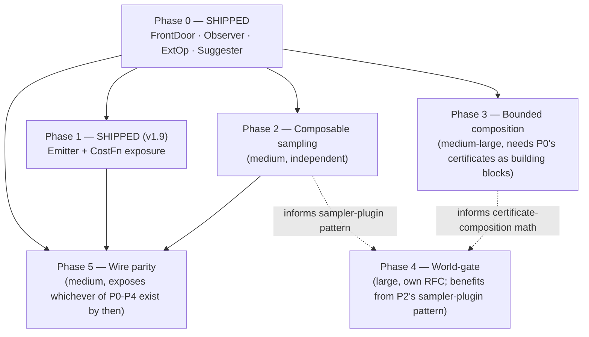

# SDK Roadmap — toward the widest extension surface the Gate can arbitrate

This document exists because "make the SDK unlimited" is a real,
legitimate goal that needs a real plan, not a slogan. It lays out what's
shipped, what's next, in what order, and — just as importantly — the
one constraint that never moves and why loosening it would defeat the
point of the project.

Companion reading: [SDK.md](SDK.md) (how to use what's shipped),
[README.md](../README.md) §15 (core-engine roadmap, priced by corpus
data — this document is the SDK-specific complement to that one),
[HISTORY.md](HISTORY.md) (dated addenda for everything already shipped).

---

## Table of contents

1. [The vision, stated precisely](#1-the-vision-stated-precisely)
2. [The one constraint that doesn't move](#2-the-one-constraint-that-doesnt-move)
3. [Phase 0 — Foundation (SHIPPED)](#3-phase-0--foundation-shipped)
4. [Phase 1 — Output & cost openness](#4-phase-1--output--cost-openness)
5. [Phase 2 — Composable sampling](#5-phase-2--composable-sampling)
6. [Phase 3 — Bounded multi-function composition](#6-phase-3--bounded-multi-function-composition)
7. [Phase 4 — World-gate (stateful/effectful semantics)](#7-phase-4--world-gate-statefuleffectful-semantics)
8. [Phase 5 — Wire parity](#8-phase-5--wire-parity)
9. [Decision framework: where does MY idea fit?](#9-decision-framework-where-does-my-idea-fit)
10. [Cross-cutting policy for every phase](#10-cross-cutting-policy-for-every-phase)
11. [Sequencing & dependencies](#11-sequencing--dependencies)

---

## 1. The vision, stated precisely

The goal, in the words it was asked in: *"a tech that can unlimitedly
extend functions."* That phrase has a true reading and a false one, and
this roadmap commits to the true one:

> **True reading**: extend the SPACE of pure, total, numeric
> computations DGE can certify — new semantics, new optimization
> knowledge, new input languages, new output targets, new sampling
> strategies, new ways of composing already-certified pieces — as far
> as that space goes, without ever asking anyone to trust a plugin's
> claim about its own correctness.
>
> **False reading**: extend DGE into a general-purpose program
> transformer that can certify anything, including state, I/O, and
> multi-function programs, with the same one-line trust model. This is
> not the plan, and building toward it would not be "more open" — it
> would be a different, unsound tool wearing this one's certificates.

Every phase below is a step toward the true reading. Phase 4 goes as far
as the false reading *can* honestly be approached — with sampling and
tagging that make the resulting claims weaker and say so — and even
that is the edge, not a stepping stone to unconditional trust.

---

## 2. The one constraint that doesn't move

**The Gate is the sole arbiter, and arbitration stays black-box.** Every
phase below adds a new *kind of thing* the Gate can be asked to compare
— new semantics (v1.7), new rewrite hypotheses (v1.8), new output
encodings, new sampling coverage, new composite objects, eventually new
*kinds of state* — but never a new way for something to become
`VerifiedTerm` without going through it. This is not a limitation the
roadmap works around; it's the one thing that makes every other phase
safe to build quickly, by contractors nobody has to vet, without a
security review per plugin. Loosening it would make each subsequent
phase slower and riskier, not faster.

Concretely, this means every future phase must answer three questions
before it ships, the same three every past phase answered:

1. **What does a plugin get to decide, and what does the Gate still
   decide?** (Phase boundary line.)
2. **What happens when a plugin lies or misbehaves?** (Must be: a
   refutation or an honest refusal, never a silent wrong certificate.)
3. **What does the certificate say about what it now depends on?**
   (Tagging discipline — `ext_semantics` in v1.7 is the precedent every
   later phase follows.)

---

## 3. Phase 0 — Foundation (SHIPPED)

| Capability | Version | What it opened |
|---|---|---|
| `FrontDoor` | v1.0 | Any input language/format → candidate Term. Unrestricted on the input side. |
| `Observer` | v1.0 | Read-only visibility into extraction/gate events. |
| `register_ext_op` (`Op::Ext1`/`Ext2`) | v1.7 | New pure per-call SEMANTICS — any `&[f64] -> f64`, composes with core Σ and inside `fold`. |
| `Suggester` + `Engine::optimize` | v1.8 | New OPTIMIZATION knowledge — candidate rewrites, always gated against the original term, cost-filtered before the expensive check. |

This is the base every later phase builds on. Nothing below changes how
these four work; they compose with everything that follows.

---

## 4. Phase 1 — Output & cost openness

**Status: SHIPPED (v1.9, 2026-07-18). Delivered in under a session, as
projected.** `sdk::Emitter` + `RustEmitter` + `Engine::emit_with`;
`Engine::optimize_with_cost` taking any `rules::CostFn`. 3 gates in
`crates/sdk/tests/phase1_test.rs`. See `docs/HISTORY.md` Addendum 9.

Two independent, low-risk additions, buildable together or separately:

### 4.1 Pluggable `Emitter`
```rust
trait Emitter { fn emit(&self, term: &Term, cert: &Certificate) -> String; }
```
Today, certified output is Rust-only (`cli::emit::emit_rust`). Opening
emission means a `VerifiedTerm`'s certified form can target GLSL, WGSL,
C, Lua, or anything else — directly, not via a hand-rolled sexpr walker
downstream of the SDK. **Why it's safe**: emission runs strictly after
promotion; it can never affect what gets certified, only how the already
-certified result is printed. Zero new trust boundary.

### 4.2 Exposed `CostFn` for `optimize`
`Engine::optimize` currently hardcodes `rules::cost::DefaultCost`
internally. Add `Engine::optimize_with_cost(fn_name, &original, &dyn
CostFn)` so a domain plugin can say "minimize texture-sample-equivalent
ops" for an SDF library, or "minimize estimated cycles" from a
calibrated table, instead of generic node count. **Why it's safe**: L2
("cost irrelevance") — already the operating principle for the
kernel's own `CalibratedCost` — a cost function only picks a
representative among already-certified-equal terms; it can never change
whether something is certified.

**Unlocks from earlier conversation**: "emit certified SDF math straight
into a shader" becomes a first-class `Emitter`, not a workaround.

---

## 5. Phase 2 — Composable sampling

**Status: designed, not started. Size: medium.**

`Gate`'s input distribution (μ′) is fixed today — every certificate
quantifies over the same boundary-heavy, log-uniform-magnitude
distribution regardless of domain. A `SamplerPlugin` would let a
plugin supply *additional* samples biased toward its actual domain (an
audio plugin biasing toward [-1, 1]; an SDF plugin biasing toward
scene-relevant coordinates) for a tighter, more relevant certificate.

```rust
trait SamplerPlugin {
    fn extra_samples(&self, rng: &mut Rng, arity: usize) -> Vec<f64>;
}
```

**The one design rule that makes this safe**: composition is strictly
**additive**. A `SamplerPlugin` can only ADD samples on top of the core
μ′ boundary set (±0, ±∞, NaN, subnormals, L=0) — it can never replace
or narrow it. This must be enforced by the type signature, not by
convention: there should be no method on the trait that could be used to
*skip* the core distribution. Get this wrong and a malicious or careless
sampler could steer the Gate away from exactly the inputs most likely to
find a real counterexample — this is the one place in the whole roadmap
where a plugin bug could silently weaken a claim rather than loudly
refuse, so it needs the most scrutiny of any phase-1/2 item.

**Certificate consequence**: a term gated with extra sampling records
that fact (`mu_spec` already carries a free-text description of the
distribution — extending it, or adding a parallel `sampler_tags` field
mirroring `ext_semantics`, is the natural implementation).

---

## 6. Phase 3 — Bounded multi-function composition

**Status: designed, not started. Size: medium-large.**

This is the direct answer to *"can I optimize interactions between an
entire codebase"* — scoped down from the impossible general version to
the version that's actually buildable: a `Program`, a DAG of
**already-individually-certified** `VerifiedTerm`s connected by
call edges, where:

* each node is independently gated exactly as today (no change to
  single-function certification);
* each edge is checked for arity/shape compatibility at composition
  time (a structural check, not a new trust boundary);
* the **whole graph's** end-to-end behavior can be differential-gated
  against a reference multi-function program, the same bitwise/μ′
  mechanism applied to a composite input/output instead of a single
  term.

**What this is not**: general call-graph optimization, cross-function
inlining decisions made by a plugin, or reasoning about programs with
side effects between calls. Every node stays a pure Term; composition
is data flow between pure functions, nothing else. This is "interactions
between certified pure functions," not "interactions between arbitrary
code" — a real, useful capability that stays inside the purity
boundary rather than trying to widen it.

**Why this is medium-large, not small**: it's the first phase touching
how *multiple* certificates relate to each other, which means new
questions about certificate composition (does composing two Tier B
claims with δ₁ and δ₂ produce a meaningful combined δ? — yes, via
straightforward probability composition, but it needs to be derived and
stated, not assumed) that don't arise when every phase before this one
only ever touched one term at a time.

---

## 7. Phase 4 — World-gate (stateful/effectful semantics)

**Status: sketched in conversation, no design document yet. Size: large
— explicitly recommended to get its own RFC-review doc (matching the
project's own precedent — see `docs/HISTORY.md` Part IV) before any
code.**

This is the true P3 gap — state persisting across calls, mutation,
multiple outputs — named consistently across every concrete example in
this conversation (network calls, an audio instrument's persistent
phase, `average`'s `&mut self` estimators). The design sketch, unchanged
from when it was first proposed:

Generalize the judged object from `env → f64` to
`(World, env) → (World′, outputs)`, where:

* a plugin supplies the **state type**, a **state sampler** (so μ′-like
  coverage extends to the state space, not just scalar inputs), and a
  **canonical serialization** (so "equal" has a bitwise meaning for
  something that isn't an f64);
* the Gate's comparison becomes bitwise-on-serialized-observation —
  mutation, multi-output, and persistent state all fit this shape;
* the reference side is the natively-executed original — the field-
  trial harness already does exactly this differential for pure code
  today, so the *mechanism* of "run both, compare bytes" is proven; what's
  new is only the object being compared.

**Two additions this phase requires that no earlier phase needed**,
both cheap in isolation but both genuinely new trust surface:

1. A **determinism pre-gate**, generalized from v1.7's per-sample
   double-run to a per-(state, input) double-run — same idea, larger
   object.
2. **Certificate tagging for sampler honesty**: a world-gate claim is
   only as good as the plugin's state sampler's coverage. The
   certificate must say so explicitly — something like `"equivalent
   modulo ext(X) AND modulo state-sampler(Y)'s coverage"` — because
   unlike a scalar μ′ sample (where the core's fixed, well-understood
   distribution backs every claim equally), a *bad* state sampler is a
   qualitatively different, weaker guarantee that must never be
   presented with the same confidence language as a core-Σ Tier B
   claim.

**Why this genuinely needs its own document before code**, stated
plainly: every phase before this one had a design that was "obviously"
safe once the mechanism was described (arbitration was already
black-box; adding a new *kind* of thing to arbitrate never touched that
mechanism). Phase 4 is the first phase where the *quality* of a
plugin-supplied component (the state sampler) directly determines the
*strength* of a claim, rather than only determining whether a claim
exists at all. That's a new kind of risk this roadmap has not fully
worked through, and rushing it — as flagged when it first came up —
would risk exactly the kind of "looks safe, isn't" issue this whole
project exists to prevent.

---

## 8. Phase 5 — Wire parity

**Status: not started. Size: medium, mostly engineering not design.**

Ext-op and Suggester registration are in-process (SDK) only; `dge-serve`
documents the `ext:` syntax but cannot accept a new closure over the
network. Closing this gap safely is an open design question with at
least two candidate approaches, not yet chosen:

* **WASM-sandboxed closures** — a plugin ships a `.wasm` module
  implementing its op/suggester; the server loads and runs it in a
  sandbox. Real isolation, real portability, real engineering cost
  (WASM host setup, a stable ABI for the closure signature).
* **Subprocess RPC** — the server spawns/calls out to a plugin process
  per registration, communicating over a fixed protocol. Simpler to
  build, weaker isolation, and adds a latency/reliability dimension the
  in-process path doesn't have (this is also why "a network extension"
  was the wrong shape earlier in this conversation for a per-CALL op —
  it's a much better fit for a per-REGISTRATION cost, paid once).

This phase is ordered last because it doesn't unlock new *capability*,
only new *deployment shape* for capability Phases 0–4 already unlock —
polyglot/remote integrators get what in-process Rust integrators already
have.

---

## 9. Decision framework: where does MY idea fit?

A reusable checklist, built from every concrete example worked through
in this conversation, so future ideas don't need a fresh round-trip:

```
Is the interesting part expressible as f(inputs) -> outputs,
evaluated fresh each call, no memory of prior calls?
│
├─ YES, one scalar output, pure math
│   └─→ Phase 0 (ext op), TODAY.
│       Examples worked out: SDF primitives, audio per-sample curves,
│       activation functions, financial distributions.
│
├─ YES, but needs in-call iteration over a buffer/sequence
│   └─→ Phase 0 (core `fold` + ext ops inside the body), TODAY.
│       Example worked out: a one-pole audio filter with a nonlinear
│       stage — state lives in the fold accumulator, gated fine.
│
├─ YES, but the "function" is really several ALREADY-CERTIFIABLE
│  functions whose interaction you want to reason about together
│   └─→ Phase 3 (bounded composition). Example: two certified terms
│       feeding each other, differential-gated as a graph.
│
├─ NO — needs to remember something between separate calls
│  (persistent phase, running totals across process() calls,
│  `&mut self` estimators)
│   └─→ Phase 4 (world-gate). NOT available today. Examples worked out:
│       a synth voice's phase accumulator, `average`'s estimators.
│
├─ NO — is fundamentally about a whole program / call graph,
│  not a function (cross-function inlining, dead-code elimination
│  spanning files, general codebase optimization)
│   └─→ Out of scope, no phase targets this. There is no "program"
│       object in this system's model and none is planned; Phase 3's
│       `Program` is bounded composition of PURE pieces, not this.
│
└─ NO — is an I/O operation (network, disk, hardware) you want
   treated as a term operator
    └─→ Wrong tool regardless of phase. Do the I/O in a FrontDoor
        (once, before extraction) or your own code around DGE, and
        hand DGE a pure term. Explained in the network-extension
        discussion: the Gate's repeated/double-run sampling model is
        structurally hostile to I/O latency and non-determinism.
```

---

## 10. Cross-cutting policy for every phase

Rules that applied to Phases 0's shipped items and bind every phase
above, stated once instead of repeated per-phase:

1. **Differential-first testing.** Every new capability gets a suite
   proving the load-bearing safety claim by actually trying to break
   it — a lying plugin, a nondeterministic plugin, a chain that could
   drift meaning — not just a happy-path example. (Precedent:
   `ext_test.rs`, `suggester_test.rs`.)
   **Escalation for load-bearing quantitative claims**: a unit test
   proves a property CAN hold once; a field trial (large N, fuzzed
   inputs, MEASURED not assumed) checks how RELIABLY it holds and can
   surface bugs a single pinned case never would — Field Trial №3
   (`docs/HISTORY.md` Addendum 11) found a real arity-panic bug this
   way. New phases that make a quantitative safety claim (a catch
   rate, a "never" claim under composition) should get a field-trial
   script alongside the unit test, not instead of it.
2. **Doc examples get run, not just written.** Both v1.7 and v1.8 caught
   a real bug in a first-draft doc example (a NaN-boundary mismatch, a
   cost-tie that exercised the wrong path) by actually compiling and
   running the example against the live system. Every future phase's
   SDK.md section follows the same practice.
3. **Certificates always say what they depend on.** `ext_semantics` is
   the precedent; every future phase that lets a plugin influence a
   certified claim adds its own tag, never silently reuses the
   unqualified `CERTIFIED:` language for a plugin-dependent claim.
4. **Graduation path stays open in both directions.** An ext op that
   turns out to be provably-general algebra can graduate into a real
   core Σ op (the Rnd32 precedent); a suggester rule that turns out to
   be Z3-discharge-able can graduate into the Dec rule table. Nothing
   in this roadmap is meant to be a permanent second-class citizen if
   it earns kernel status.
5. **No phase weakens an earlier phase's guarantee.** Phase 2's
   additive-only sampling rule is the sharpest instance of this, but it
   generalizes: new capability is layered on, never substituted for,
   the guarantees Phase 0 already shipped.

---

## 11. Sequencing & dependencies



**Recommended next step**, if the goal is maximum reachable
functionality per unit of risk: **Phase 1**, both halves together — it's
small, independent of everything else, has no new trust boundary, and
directly unlocks the "certified output into GLSL/WGSL/Lua" and
"domain-specific cost" use cases named earlier in this conversation.
Phase 3 is the next-highest-leverage item after that if the goal is
specifically the "interactions across code" ask; Phase 4 should not be
started without first writing the RFC-review document Phase 4's section
above calls for, regardless of how the other phases land.
